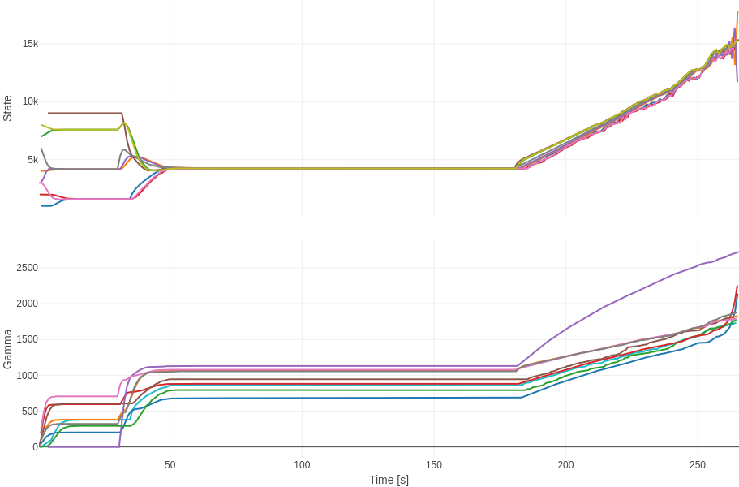
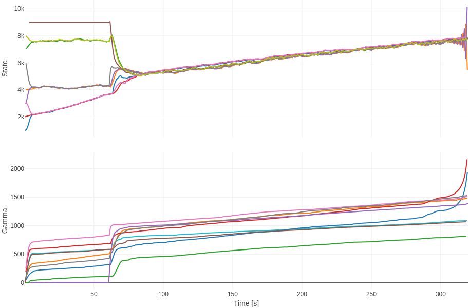
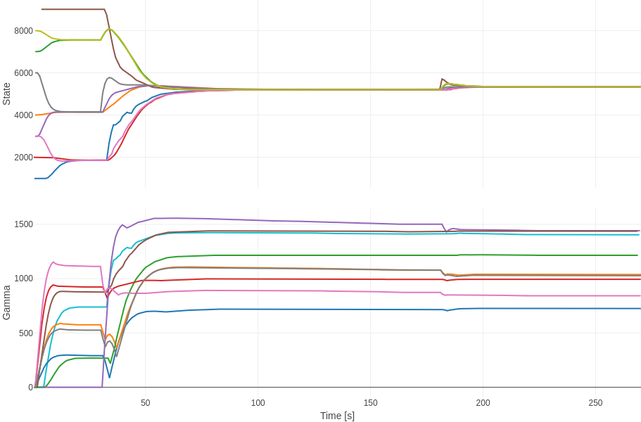
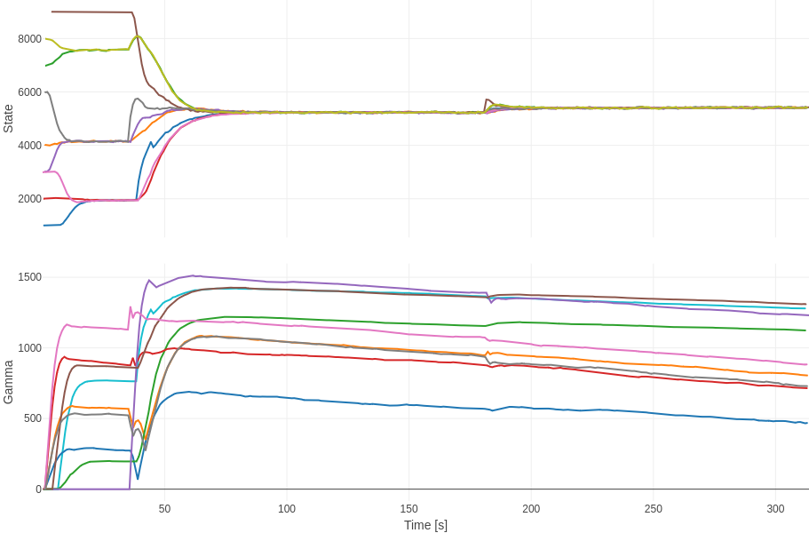

# Consensus

This project is for implementing a consensus algorithm with RaspberryPis via Wifi/BLE and nrf52DK via BLE.

## Components

In this project, we need to keep in mind:

* A node is the physical hardware which is composed by a RaspberryPi attached by an USB cable to a nrf52DK.
* An edge-device is inside a node and represents an aplication which can be of 3 types: ble, wifi, bridge. In this way, a single node can act 3 different edge-devices at the same time.
* A router with is in cherge of deployin a LAN.
* The hub-server can be deployed in a laptop and is in charge of configuring the network, parameters and triggers the start of the algorithms for the edge-devices.
* The user-interface which can be visualized a browser in the same laptop of the heb-server.

## Steps for implementation

1.- For all nrf52DK you need to burn the firmware which source code is in the folder `/consensus/nordic` (see the [nordic dev academy courses](https://academy.nordicsemi.com/) in order to do this). Use nordic SDK 2.7.0. 

2.- For all the RaspberryPis create an SD card with Raspian Bookworm OS and enable SSH-server (username: `control`, password: `control1234`). Via a keyboard-screen (or SSH-client), you can then install nvm:0.40.1 and the node:22.11.0 and install "expect": `sudo apt install expect`. Then upload all the contents of `/consensus/raspberry` (except for `node_modules` nor `package-lock.json`) and install all node dependencies with `~/Desktop/consensus/raspberry$ npm install`. Additionally you need to connect to the LAN via wifi, use `sudo raspi-config` for setting the wifi credentials, and get the dynamic LAN ip address (which normally doesn't change in the router) with `ip a` and remember it.

3.- In your laptop you need to have the `~/Desktop/consensus/raspberry`; with SSH-client, nmv and node installed (it's not necessary to install expect), with the node modules of the project installed and connected to the router LAN.

4.- In the physical world create a node by ataching 1 nrf52DK with 1 raspberry using a usb cable. Repeat the process for every node you want to have. Note that you can connect to a node via SSH-client with the RaspberryPi credentials and its LAN ip address.

5.- From your laptop open 3 terminals for each node and navigate to the `~/Desktop/consensus/raspberry` and the run 3 edge-devices processes on each terminal: `node back ble`, `node back wifi`, `node back bridge`.

6.- From your laptop open the file `~/Desktop/consensus/raspberry/net.js` to edit the network graph and parameters by simply changing the `NODES` variable. Here is an example for 3 nodes:
```js
// file: /consensus/raspberry/net.js
...
// 9node-clusters
//       3 --- 9
//        \   /
//          6
//        /   \
// 7 --- 1     8 --- 2
//  \   /       \   /
//    4           5
NODES = {
  1: {ip: '192.168.1.112', type: TYPE_BLE,    enabled: true,  neighbors: [4,6,7],   clock: 1000, state: 1000, gamma: 0, lambda: 100, pole: 50, dead: 0, disturbance: {random: true, offset: 0, amplitude: 0, phase: 0, samples: 1}},
  2: {ip: '192.168.1.112', type: TYPE_WIFI,   enabled: true,  neighbors: [5,8],     clock: 1000, state: 4000, gamma: 0, lambda: 100, pole: 50, dead: 0, disturbance: {random: true, offset: 0, amplitude: 0, phase: 0, samples: 1}},
  3: {ip: '192.168.1.112', type: TYPE_BRIDGE, enabled: true,  neighbors: [6,9],     clock: 1000, state: 7000, gamma: 0, lambda: 100, pole: 50, dead: 0, disturbance: {random: true, offset: 0, amplitude: 0, phase: 0, samples: 1}},
  4: {ip: '192.168.1.190', type: TYPE_BLE,    enabled: true,  neighbors: [1,7],     clock: 1000, state: 2000, gamma: 0, lambda: 100, pole: 50, dead: 0, disturbance: {random: true, offset: 0, amplitude: 0, phase: 0, samples: 1}},
  5: {ip: '192.168.1.190', type: TYPE_WIFI,   enabled: true,  neighbors: [2,8],     clock: 1000, state: 3000, gamma: 0, lambda: 100, pole: 50, dead: 0, disturbance: {random: true, offset: 0, amplitude: 0, phase: 0, samples: 1}},
  6: {ip: '192.168.1.190', type: TYPE_BRIDGE, enabled: false, neighbors: [1,3,8,9], clock: 1000, state: 8000, gamma: 0, lambda: 100, pole: 50, dead: 0, disturbance: {random: true, offset: 0, amplitude: 0, phase: 0, samples: 1}},
  7: {ip: '192.168.1.136', type: TYPE_BLE,    enabled: true,  neighbors: [1,4],     clock: 1000, state: 3000, gamma: 0, lambda: 100, pole: 50, dead: 0, disturbance: {random: true, offset: 0, amplitude: 0, phase: 0, samples: 1}},
  8: {ip: '192.168.1.136', type: TYPE_WIFI,   enabled: true,  neighbors: [2,5,6],   clock: 1000, state: 6000, gamma: 0, lambda: 100, pole: 50, dead: 0, disturbance: {random: true, offset: 0, amplitude: 0, phase: 0, samples: 1}},
  9: {ip: '192.168.1.136', type: TYPE_BRIDGE, enabled: true,  neighbors: [3,6],     clock: 1000, state: 9000, gamma: 0, lambda: 100, pole: 50, dead: 0, disturbance: {random: true, offset: 0, amplitude: 0, phase: 0, samples: 1}},
}
...
```
7.- From your laptop open another terminal, navigate to the `~/Desktop/consensus/raspberry` and run: `node hub`. Open a browser at `http://localhost:3000`. This is optional but a good practice: press the reset button of all norf52DKs, this is a good idea when the preivious tests gives unstable results. In the user-interface select the type of the algorithm (1: pure adaptative integral, 2: adaptative PI + LPF), chande the name of the test and check the trigger option, then press `Update Params`.

8.- In the user interface you can see when the algorithm converges. At this point it is time to stop the test by unckecking the trigger button and pressing `Update Params`. You can now press the link `Open data history in a new window` and navigate to see the name of your test, click it and you can see your results.


## Some results

We consider the following topology:

```js
// 9node-clusters
//       3 --- 9
//        \   /
//          6
//        /   \
// 7 --- 1     8 --- 2
//  \   /       \   /
//    4           5
```

Were initially node 6 is disconected from the complete graph, then (at second 30 or 60) node 6 connects to the network. At second 160 we add a constant disturbance when possible.


### Adaptative Pure Integral Consensus Algorithm


9-node network setup over time. Initially, the network forms 4 clusters: [1, 4, 7], [2, 5, 8], [3, 9], and [6], with each cluster converging to its own consensus value. Afterward, node 6 connects to all clusters, leading to a global consensus. Finally, node 6 is subjected to a constant disturbance of 500, and the network tries to converge to an uptend line which is not achieved since gamma diverges. Note that no random disturbance is included in this example.


Same setup as before, but now with the addition of random disturbances on all nodes of amplitude 50 and is not regarded the addition of a constant randome distubance during the experiment. Initially, all clusters try to converge to their own concensus (contant or uptend line). Afterward, node 6 connects to all clusters, and the network tries to converge to an uptend line which is not achieved since gamma diverges.

### Adaptative PI+LPF Consensus Algorithm


9-node network setup over time. Initially, the network forms 4 clusters: [1, 4, 7], [2, 5, 8], [3, 9], and [6], with each cluster converging to its own consensus value. Afterward, node 6 connects to all clusters, leading to a global consensus. Finally, node 6 is subjected to a constant disturbance of 1000, and the network demonstrates robustness by converging to a new consensus. Note that no random disturbance is included in this example.


Same setup as before, but now with the addition of random disturbances on all nodes of amplitude 50. The algorithm still demonstrates robustness. Note that gamma tends to decrease, unlike in the absence of random disturbances, where it remains constant. This decrease is beneficial, as large gamma values can make the network more unstable.